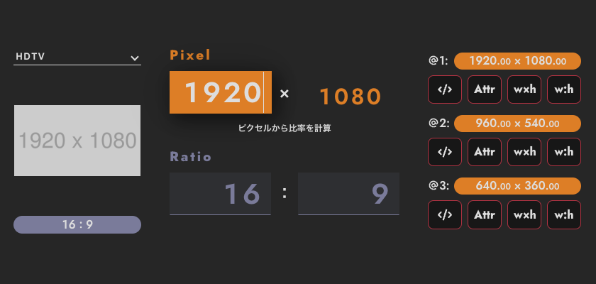

# Aspect

[GitHub Pages](https://koishikawa-inc.github.io/aspect/)

## できること

- 入力したピクセル数を元に、アスペクト比を調べる
- 入力アスペクト比を元に、ピクセル数を調べる
- 画像のピクセル数を調べる
- 画像のアスペクト比を調べる
- 「img タグ」をクリップボードにコピーする (@1, @2, @3 サイズ)
- 「width・height 属性」をクリップボードにコピーする (@1, @2, @3 サイズ)
- 「CSS width・height プロパティ」をクリップボードにコピーする (@1, @2, @3 サイズ)
- 「CSS aspect-ratio プロパティ」をクリップボードにコピーする (@1, @2, @3 サイズ)

## 技術資料

### 開発環境

- [vite](https://vitejs.dev/)

### 言語

- React
- Typescript
- scss

### ライブラリ

- [tippy.js](https://atomiks.github.io/tippyjs/)

  ツールチップ

- [framer-motion](https://www.framer.com/motion/)

  アニメーション

- [react-dropzone](https://react-dropzone.js.org/)

  ファイルドラッグ&ドロップ

- [react-icons](https://react-icons.github.io/react-icons)

  アイコン

- [react-uuid](https://github.com/RickBr0wn/react-uuid)

  id 生成

### フォント

- [Jost](https://fonts.google.com/specimen/Jost)

## 今後

- UI 改善
- CSS 実装方法変更
- コード整理・リファクタリング
- 機能改善
